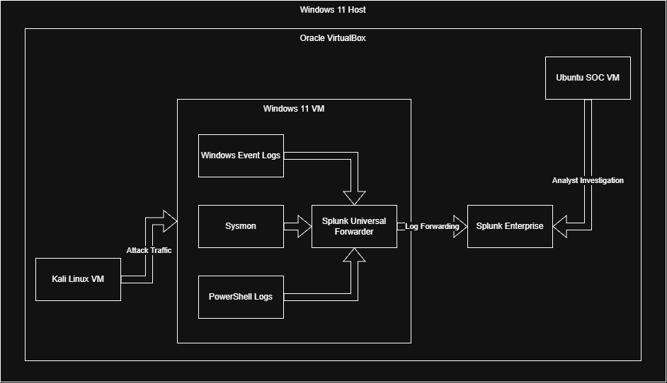
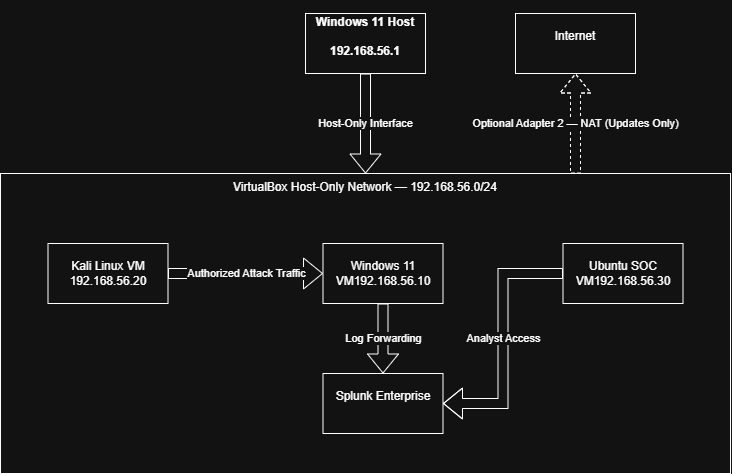

# Home Security Operations Center (Home SOC Lab)


> **A flagship cybersecurity portfolio project focused on designing, building, operating, detecting, investigating, and documenting a realistic Security Operations Center (SOC) using Splunk, Sysmon, Windows Event Logs, and the MITRE ATT&CK framework.**

---

## Overview

This repository documents the design, implementation, and operation of a professional Home Security Operations Center (SOC) built inside an isolated virtual laboratory.

The objective is to simulate the responsibilities of a Security Operations Center by collecting security telemetry, detecting malicious activity, investigating alerts, performing threat hunts, responding to simulated incidents, and documenting findings using industry-standard defensive security practices.

Rather than serving as a collection of disconnected exercises, this repository follows the complete lifecycle of designing, building, validating, operating, and continuously improving a defensive security monitoring environment.

The finished project is intended to demonstrate the practical skills expected of an entry-level SOC Analyst, Blue Team Analyst, Cybersecurity Analyst, Security Operations Intern, or Junior Detection Engineer.

---

## SOC Architecture



The architecture illustrates the flow of authorized attack traffic, endpoint telemetry collection, log forwarding to Splunk Enterprise, and analyst investigation from the Ubuntu SOC workstation.

---

## Network Architecture



The network design uses an isolated VirtualBox Host-Only network for controlled communication between lab systems, with optional NAT connectivity used only when Internet access is required.

---

## Project Goals

The primary goal of this project is to build a fully functioning, end-to-end Security Operations Center that demonstrates the complete defensive security workflow:

- Plan
- Build
- Collect
- Detect
- Investigate
- Respond
- Document
- Improve

Every component of this repository is designed to be reproducible, thoroughly documented, validated with evidence, and explainable during a technical interview.

---

## Objectives

- Build an isolated Windows-based Security Operations Center
- Deploy and configure Splunk Enterprise
- Configure Sysmon and Windows security logging
- Centralize and analyze security telemetry
- Develop and validate custom detections
- Perform threat hunting using Splunk Search Processing Language (SPL)
- Simulate realistic attack scenarios safely
- Investigate alerts and document security incidents
- Map detections to the MITRE ATT&CK framework
- Produce professional documentation, evidence, and investigation reports
- Build an interview-ready cybersecurity portfolio project

---

## Technology Stack

| Category | Technologies |
|-----------|--------------|
| Virtualization | VirtualBox |
| Operating Systems | Windows 11, Kali Linux |
| SIEM | Splunk Enterprise |
| Log Collection | Splunk Universal Forwarder |
| Telemetry | Sysmon, Windows Event Logs, PowerShell Logging |
| Framework | MITRE ATT&CK |
| Documentation | Markdown, Git, GitHub |

---

## Current Environment

| Component | Status |
|-----------|--------|
| Host Operating System | Windows 11 |
| Hypervisor | VirtualBox |
| Windows Virtual Machine | Planned |
| Kali Linux Virtual Machine | Planned |
| Splunk Enterprise | Planned |
| Splunk Universal Forwarder | Planned |
| Sysmon | Planned |
| Windows Event Logging | Planned |

---

## Skills to Be Demonstrated

This project is designed to demonstrate practical experience with:

- Security Operations (SOC)
- Blue Team Operations
- Detection Engineering
- Threat Hunting
- Windows Administration
- Windows Security Auditing
- Windows Event Analysis
- Sysmon Configuration
- Windows Audit Policy
- PowerShell Logging
- Splunk Search Processing Language (SPL)
- Log Analysis
- Incident Response
- Digital Forensics Fundamentals
- MITRE ATT&CK Mapping
- Technical Documentation
- Git Version Control

---

## Repository Structure

```text
home-soc-lab/
├── assets/
├── configs/
├── detections/
├── diagrams/
├── docs/
├── evidence/
├── hunts/
├── incidents/
├── journal/
├── metrics/
├── references/
├── screenshots/
├── scripts/
├── .gitignore
├── CHANGELOG.md
├── LICENSE
└── README.md
```

---

## Repository Highlights

As development progresses, this repository will include:

- Professional architecture diagrams
- Network diagrams
- Splunk dashboards
- Detection engineering documentation
- Threat hunting documentation
- Incident investigation reports
- Detection validation records
- MITRE ATT&CK coverage mapping
- Safe attack simulations
- Evidence-backed testing and validation
- Technical documentation for every milestone
- Professional Git version history

---

## Project Progress

| Phase | Status |
|--------|--------|
| Planning & Project Foundation | ✅ Complete |
| Infrastructure | 🟡 In Progress |
| Logging & SIEM Deployment | ⬜ Not Started |
| Telemetry & Event Analysis | ⬜ Not Started |
| Detection Engineering | ⬜ Not Started |
| Threat Hunting | ⬜ Not Started |
| Dashboards | ⬜ Not Started |
| Safe Attack Simulations | ⬜ Not Started |
| Incident Response | ⬜ Not Started |
| Capstone Investigation | ⬜ Not Started |

---

## Current Status

| Item | Status |
|------|--------|
| GitHub Repository | ✅ Complete |
| Project Structure | ✅ Complete |
| Documentation Framework | ✅ Complete |
| Current Milestone | Infrastructure |

---

## Recruiter Note

This repository is intentionally developed through incremental milestones. Early commits establish the project's foundation, while later milestones introduce infrastructure, telemetry collection, detection engineering, threat hunting, dashboards, incident response, and a complete capstone investigation.

The Git history is intended to demonstrate technical growth, engineering discipline, thorough validation, and professional documentation—not just the finished product.

---

## Disclaimer

This project is developed exclusively inside an isolated laboratory environment for educational and defensive cybersecurity purposes.

All attack simulations are performed only against systems that I own or am explicitly authorized to test. Nothing contained in this repository should be interpreted as authorization to test, access, or attack systems without explicit permission.

---

## License

This project is licensed under the MIT License.